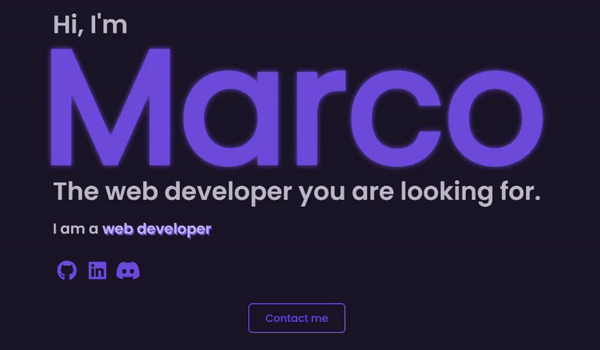
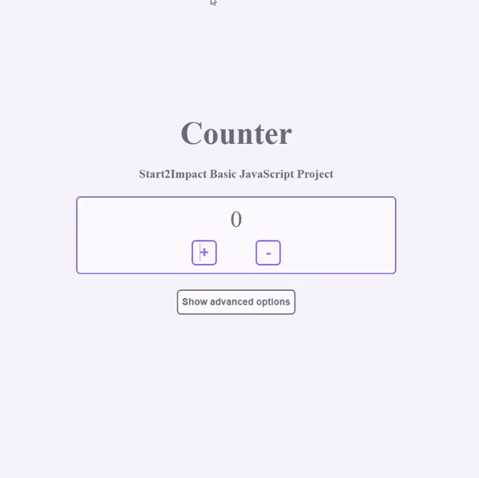
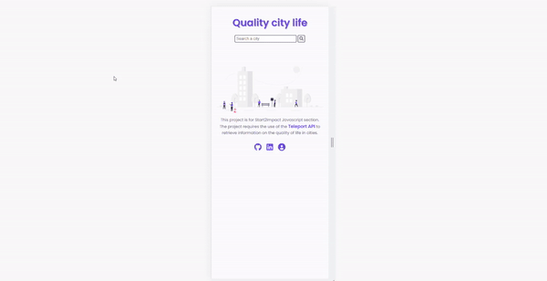

# Start2Impact Marco

Strat2Impact is a course that I decided to attend to become a Front End Developer.  
It was with them that I started this adventure and in this file there are the projects I made for them. 
I create this folder about one year away from the start of this course. 
Looking at the projects now with a more experienced point of view, I realize how much they can be improved and poorly written, I still want to leave the projects like this as a reminder of what they taught me and the challenges I faced in making them.

## Projects :

## - HTML & CSS

A Portfolio, my first project is also the one to which I dedicated the most time and effort. 
This project put a strain on my web design and css skills, as not everything that went through my head at first was visually beautiful / achievable with my experience.

## - JS Basic

A Javascript easy counter (no responsive)

## - JS Advanced

A site that monitors the quality of life in the larger cities, this is a project that has tested my skills, I had to deal with advanced js concepts + things that were completely foreign to me and that sent me into total confusion (libraries + bundlers (ex: webpack, axios, ect))

## - React

A vegetarian recipe site built with react and [Spoonacular API](https://spoonacular.com/food-api/docs).  
The realization of this site was quite easy and I created it in a short time, thanks to the teachings of react by [Bob ziroll](https://www.linkedin.com/in/bobziroll/) ([scrimba teacher](https://scrimba.com/learn/learnreact)) and to this [youtube video](https://www.youtube.com/watch?v=xc4uOzlndAk&t=1s) by developedbyed.

## - Final Project

A site that keeps track of the world's climate changes, with graphic demonstration (really bad), created with react and [Global Warming API](https://global-warming.org/)  
This is the site that in terms of design I think is the most successful, this too I did it in a short time (like all the others except the portfolio) and therefore it results with little attention to detail.  
Thanks to this [youtube video](https://www.youtube.com/watch?v=ymavtyRpT0E&t=3748s) for the three.js tutorial, and the [nasa website](https://climate.nasa.gov/) for the design inspiration.

